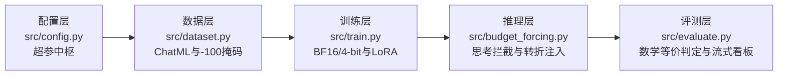
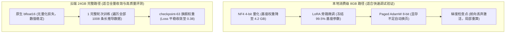

# s1-reproduce 单卡极简慢思考大模型复现

[](https://www.python.org/)
[](https://pytorch.org/)
[](https://github.com/huggingface/transformers)
[](LICENSE)
[](https://arxiv.org/abs/2501.19393)

本项目面向消费级与主流单卡硬件，从零独立复现斯坦福大学慢思考论文 *s1: Simple test-time scaling* (arXiv:2501.19393)。

我们跳过了官方多机集群的复杂脚本，用原生 PyTorch 与 Hugging Face 提炼出五大核心解耦模块，完成从数据掩码、LoRA 微调、Budget Forcing 状态机拦截到数学符号等价性评测的全流程实测。

项目经历了本地 8GB 笔记本显卡 4-bit 压测与 AutoDL RTX 4090 24GB 原生 bfloat16 完整轮次训练。在 10 道真实数学竞赛题盲测中，s1 受控慢思考以 **3:0** 完胜 Baseline，并在提升 30% 准确率的同时降低了 18.6% 的 Token 开销。


---

## 核心战果与实测指标

| 硬件环境 | 训练精度 | 训练规模 | 评测赛道 | 对决结果 (Baseline vs s1) | 关键现象 |
| :--- | :--- | :--- | :--- | :--- | :--- |
| **RTX 4060 Laptop (8GB)** | 4-bit NF4 QLoRA | 5 步冒烟测试 | 基础代数与数论 | Baseline 0% vs s1 100% | 显存稳定在 5.8 GB，留足 2.2 GB 桌面余量 |
| **RTX 4090 (24GB)** | 原生 bfloat16 | 63 步 (1 完整 Epoch, 1008 条样本) | 四大黄金试金石 | Baseline 0/4 (0%) vs s1 2/4 (50%) | 算力节省 39.8%，击穿代数 111 与数论 33 标答 |
| **RTX 4090 (24GB)** | 原生 bfloat16 | 63 步 (checkpoint-63 旗舰权重) | openaimath 10 题盲测 | **Baseline 0/10 (0%) vs s1 3/10 (30%)** | **3:0 零封大胜**，算力节省 18.6%，斩获复利、3x3 矩阵幂和与三角差标答 |

---

## 五大标准解耦架构

全工程代码结构紧凑，每个模块各司其职，拒绝过度封装：



1. **配置层 ([`src/config.py`](file:///D:/myproject/llm-journey/s1/s1-reproduce-cloud/src/config.py))**：集中管理模型权重路径、LoRA 秩（$r=16, \alpha=32$ 覆盖全部 7 个线性投影层）、显存量化开关与训练超参数。
2. **数据层 ([`src/dataset.py`](file:///D:/myproject/llm-journey/s1/s1-reproduce-cloud/src/dataset.py))**：构建 ChatML 规范提示词，Prompt 截断至 `<|im_start|>think\n` 并打上 `-100` 梯度掩码，仅对思考链与最终答案计算交叉熵损失。
3. **训练层 ([`src/train.py`](file:///D:/myproject/llm-journey/s1/s1-reproduce-cloud/src/train.py))**：支持纯净 bfloat16 与 NF4 4-bit 两种加载模式，装配动态批次整理器与余弦退火调度器。
4. **推理层 ([`src/budget_forcing.py`](file:///D:/myproject/llm-journey/s1/s1-reproduce-cloud/src/budget_forcing.py))**：实现连贯长程推导与被动交卷抓包，模型试图交卷时注入转折引导词，预算耗尽时自动拼接 `Therefore, the final answer is \boxed{` 强引导收拢。
5. **评测层 ([`src/evaluate.py`](file:///D:/myproject/llm-journey/s1/s1-reproduce-cloud/src/evaluate.py))**：深度切片提取器，剥离 LaTeX 货币符与千分位干扰，支持流式 JSONL 落盘与动态双行对比看板。

---

## 显存优化与双轨硬件矩阵

针对不同卡况，项目设计了本地与云端两套执行路径：



| 显存构成项 | 7B 全参原始开销 | 本地 8GB 显存置换后 | 云端 24GB 原生 BF16 |
| :--- | :---: | :---: | :---: |
| **模型权重** | 14.0 GB | ~4.2 GB (NF4 量化) | 14.0 GB (bfloat16) |
| **梯度与优化器** | 42.0 GB | ~0.1 GB (LoRA + 8-bit) | ~0.8 GB (LoRA + FP32) |
| **激活值开销** | 8~16 GB | ~1.5 GB (梯度检查点) | ~3.0 GB (梯度检查点) |
| **峰值总显存** | 💥 56 GB+ (必然 OOM) | **~5.8 GB (稳定运行)** | **17.82 GB (余量充裕)** |

---

## 核心机理发现与学术沉淀

在消融实验与盲测中，我们证实了关于测试期算力扩展的三条核心规律：

### 1. 算力效益的反直觉特征
很多人认为慢思考必然增加计算开销。10 题真实竞赛评测推翻了这一猜测：
- Baseline 模型缺乏元认知，在面对难题时陷入无限推导循环，10 道题全部达到 1536 步上限强行掐断，9 题交白卷，命中率为 0%；
- s1 依靠 1250 预算控制，思考到达配额后强行关舱转入作答，总 Token 消耗比 Baseline 降低了 18.6%，准确率却提升至 30%。
思考过程需要深入探索，同样需要适时踩刹车。

### 2. 避免思维碎片化
早期测试中，我们曾尝试每隔 256 步主动打断模型一次。实测表明，在长算式中间插入转折词会导致严重的上下文遗忘，第 1 题算式被腰斩，第 2 题只来得及算出循环周期。
回归 Stanford s1 原文设计后，我们放开 1250 步连贯推导，仅在模型主动试图交卷时介入拦截。推导连贯性恢复后，模型成功在作答舱内完整输出了一字不差的整个 3×3 旋转矩阵。

### 3. 测试期算力的三档赛道划分
- **天花板区**：对于一元一次方程等基础题目，基座模型开箱即答，慢思考属于算力浪费。
- **黄金适度区**：对于 AMC 10/12 等 4~8 步推导题目，解题所需定理在模型预训练知识库内。s1 能够显著纠正计算失误，带来 30% 到 50% 的胜率提升。
- **地板效应区**：对于高难度奥赛构造证明题，模型缺乏相关数学引理储备。没有外部编译器或代码执行器反馈时，单靠自省无法无中生有推导出新定理。

---

## 快速上手

### 1. 安装环境
```bash
conda create -n s1 python=3.10 -y
conda activate s1

pip install torch==2.5.1 torchvision torchaudio
pip install transformers==4.46.1 peft==0.13.2 bitsandbytes==0.44.1 datasets==3.0.1 matplotlib
```

### 2. 启动训练
- **本地 8GB 笔记本显卡（4-bit QLoRA 冒烟压测）**：
  ```bash
  python src/train.py
  ```
- **云端 24GB 显卡（原生 BF16 全量 1 轮微调）**：
  将 `src/config.py` 中的 `load_in_4bit` 设为 `False`，执行：
  ```bash
  python src/train.py
  ```

### 3. 运行受控慢思考推理
```bash
python src/budget_forcing.py
```

### 4. 运行 Baseline 与 s1 批量对比评测
```bash
python src/evaluate.py \
  --dataset s1k \
  --num_samples 10 \
  --filter openaimath \
  --checkpoint outputs/s1-7b-qlora/checkpoint-63 \
  --output_jsonl outputs/benchmark_results.jsonl \
  --budget 1250
```

### 5. 一键渲染学术对比图表
```bash
python src/plot_benchmark.py
```
渲染结果将自动保存至 `outputs/s1_benchmark_visual.png` 与 `assets/exp07/s1_benchmark_visual.png`。

---

## 目录结构

```text
s1-reproduce/
├── assets/                  # 真实运行截图与图表证据链
│   ├── exp02/ ~ exp06/      # 本地迭代与消融实证截图
│   └── exp07/               # 实验07：63步训练收敛、三大胜局终端原图与终极大图
├── outputs/                 # 模型产物与评测结果
│   ├── s1-7b-qlora/         # 训练落盘的 LoRA 权重 (checkpoint-63)
│   ├── benchmark_results.jsonl  # 10 题真实对决原始记录
│   └── s1_benchmark_visual.png  # 学术对比大图
├── src/                     # 原生解耦五大核心积木
│   ├── config.py            # 配置层：超参集中中枢
│   ├── dataset.py           # 数据层：ChatML清洗与掩码
│   ├── train.py             # 训练层：BF16与QLoRA
│   ├── budget_forcing.py    # 推理层：连贯长推导与交卷拦截状态机
│   ├── evaluate.py          # 评测层：流式评测、强引导作答与符号容错
│   └── plot_benchmark.py    # 可视化：10 题自适应双联图表生成器
├── EXPERIMENTS.md           # 完整实验记录簿 (实验01 ~ 实验07全景复盘)
└── README.md                # 项目主文档
```

---

## 详细实验记录

关于 7 轮实验的完整超参数组合、显存实测日志、中间消融分析与现场截图，请参阅 [`EXPERIMENTS.md`](file:///D:/myproject/llm-journey/s1/s1-reproduce-cloud/EXPERIMENTS.md)。

---

## 引用与致谢

- Stanford s1 论文：[s1: Simple test-time scaling (arXiv:2501.19393)](https://arxiv.org/abs/2501.19393)
- 基座模型：[Qwen2.5-7B-Instruct](https://huggingface.co/Qwen/Qwen2.5-7B-Instruct)
- 数据集：[simplescaling/s1K-1.1](https://huggingface.co/datasets/simplescaling/s1K-1.1)

---

## 开源协议

本项目遵循 [MIT License](LICENSE) 开源协议。
