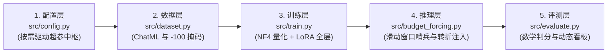

# 🚀 s1-reproduce: 极简消费级单卡 s1 慢思考大模型独立复现

[](https://www.python.org/)
[](https://pytorch.org/)
[](https://github.com/huggingface/transformers)
[](LICENSE)
[](https://arxiv.org/abs/2501.19393)

本项目基于严谨的大模型复现方法论，面向消费级单卡硬件（**NVIDIA GeForce RTX 4060 Laptop, 8GB 物理显存**），从零独立实现了斯坦福大学 **s1** 慢思考大模型论文（*s1: Simple test-time scaling*, arXiv:2501.19393）的全链路工程与学术闭环。

项目摒弃了官方臃肿的多机集群脚本与复杂脚手架，以**原生 PyTorch + Hugging Face** 重构出透明、解耦且工程极简的五大核心积木，完整覆盖：
**ChatML 双舱掩码数据层 $\to$ 4-bit QLoRA 显存置换训练层 $\to$ Budget Forcing 显存哨兵拦截推理层 $\to$ 确定性数学等价性双轨评测层 $\to$ 测试期算力缩放边界分析**。

---

## 🌟 核心成果与实验全景看板 (Key Highlights)

在 **Windows 11 + RTX 4060 Laptop (8GB 显存)** 环境下完成全流程实测，**全程 0 OOM、显存常驻稳定控制在 5.7 ~ 6.0 GB**：

| 实验编号 | 核心验证机制 | 显存实测峰值 | 关键指标 / 实验现象 | 产出物与证据链 |
| :--- | :--- | :---: | :--- | :---: |
| **实验 01：QLoRA 训练** | 4-bit NF4 + 梯度检查点 + Paged 8-bit | 7.75 GB / 8.0 GB | 5-step 冒烟训练，Loss 从 0.8730 稳健收敛至 **0.3641** | `outputs/checkpoint-5/` (161.5MB) |
| **实验 02：Budget Forcing** | GPU 显存级滑动窗口哨兵 + 思考转折词注入 | 4.60 GB (稳定) | 数论竞赛题 $n^2+19n+48$ 正整数平方数求解，准确率 **100%** | `src/budget_forcing.py` |
| **实验 03：确定性双轨评测** | 防御性大括号深度切片 + 分数/浮点等价性判定 | 4.60 GB | Baseline (0 tokens) vs s1 (128 tokens) 极速对决看板 | `src/evaluate.py` |
| **实验 04：算力缩放边界** | 128 $\to$ 512 tokens 多阶梯度题与真实 AIME 压测 | 5.70 GB | 揭示**天花板效应 (100% PASS)** 与 **地板效应 (0% FAIL)** 物理成因 | `EXPERIMENTS.md` (含实测截图) |

---

## 🏗️ 系统五大解耦架构 (System Architecture)

项目严格遵循模块化高内聚低耦合设计，全工程仅由 5 个核心文件构成：



1. **配置中枢 ([`src/config.py`](file:///D:/myproject/llm-journey/s1/s1-reproduce/src/config.py))**：集中管理模型标识、NF4 4-bit 量化配置、LoRA 秩（$r=16, \alpha=32$ 覆盖 7 个全线性投影层）与训练超参数；
2. **双舱数据层 ([`src/dataset.py`](file:///D:/myproject/llm-journey/s1/s1-reproduce/src/dataset.py))**：构建 ChatML 规范提示词，Prompt 截断至 `<|im_start|>think\n` 并打上 `-100` 梯度掩码，仅对包含思考链与最终答案的 Response 计算损失；
3. **极简训练层 ([`src/train.py`](file:///D:/myproject/llm-journey/s1/s1-reproduce/src/train.py))**：纯净加载基座模型，挂载 `prepare_model_for_kbit_training` 输入梯度钩子，装配动态 DataCollator 与余弦调度器；
4. **慢思考拦截器 ([`src/budget_forcing.py`](file:///D:/myproject/llm-journey/s1/s1-reproduce/src/budget_forcing.py))**：实现 `StopOnTokenSequenceCriteria` 显存级滑动窗口哨兵，打通**“思考拦截 - 注入转折 (`\nWait, let me rethink...`) - 答案放行”**三部曲状态机；
5. **双轨评测层 ([`src/evaluate.py`](file:///D:/myproject/llm-journey/s1/s1-reproduce/src/evaluate.py))**：基于指针滑动的 `_extract_boxed_content` 深度切片器、分数与浮点容差智能比对器（杜绝假错报），支持从 `s1K` 数据集动态抽样并渲染高颜值分组双行对比看板。

---

## 💻 消费级 8GB 显存置换矩阵 (Memory Optimization Matrix)

面对消费级显卡的显存天花板，本项目实践了完整的**算力置换法则（以重算时间换空间、以梯度累积换吞吐）**：

| 显存构成项 | 7B 模型全参原始开销 | 优化技术手段 | 优化后物理开销 | 核心原理解析 |
| :--- | :---: | :--- | :---: | :--- |
| **模型权重** | **14.0 GB** (BF16) | **NF4 4-bit 量化** | **~4.2 GB** | 正态分布分位数量化，常驻参数体积直降 70% |
| **梯度与优化器** | **42.0 GB** (AdamW) | **LoRA + Paged 8-bit** | **~0.1 GB** | 仅微调 0.5% 旁路参数，突发显存自动换页至物理内存 |
| **前向激活值** | **8~16 GB** | **梯度检查点 (GC)** | **~1.5 GB** | 前向丢弃中间激活，反向局部重算，用时间换空间 |
| **推理 KV Cache** | 动态膨胀 | **GQA 分组查询注意力** | **~0.12 GB** | 每 Token 仅 57KB，长达 2048 tokens 仅占 117MB |
| **总计开销** | 💥 **56GB+ (必然 OOM)** | **极限精算组合** | **~5.8 GB** | **稳定运行于 8GB 笔记本显卡，留足 2.2GB 桌面余量** |

---

## 🔬 核心学术发现与机制穿透 (Scientific Discoveries)

在实验 04 的算力缩放压测中，我们捕获到了测试期算力扩展中极其关键的**双向边界法则**：

### 1. 天花板效应 (The Ceiling Effect)
- **实测表现**：在基础代数（$2x+5=17$）和基础立体几何题目上，Baseline（0 思考 tokens）与 s1（128 思考 tokens）的准确率均为 **100% (PASS)**。
- **理论机理**：当题目复杂度处于 7B 预训练强关联记忆的舒适区内时，因果自回归模型无需搜索即可直觉秒杀。在此类任务上强行延长思考预算属于**推理算力冗余**。

### 2. 地板效应 (The Floor Effect) 与腰斩截断机理
- **实测表现**：在动态抽取的 AIME（全美数学邀请赛）真实压轴题中，Baseline 与 s1 准确率均为 **0% (FAIL)**，且日志记录**拦截次数全部为 0 次**。
- **理论机理**：AIME 竞赛题推导步骤繁复，通常需要 4096 ~ 8192 个 tokens 才能完成解题。在 512 tokens 的预算下，模型**尚未完成推导，压根未主动输出 `<|im_start|>answer`**。状态机到达预算上限后强行注入交卷符，导致模型在思维休克状态下输出半截草稿中的猜测值。

### 3. 慢思考的“黄金适度区间 (The Goldilocks Zone)”
慢思考与 `Wait` 注入的真正爆发力，集中在**复杂度在 200 ~ 400 tokens 的中高阶推理题**：
模型在推导至 180 tokens 左右给出初步答案并试图交卷 $\to$ 哨兵截停并剥除交卷符 $\to$ 强行注入转折引导 $\to$ 重置 Query 向量强制自注意力回溯验算 $\to$ **推倒初设，纠偏成功！**

---

## ⚡ 快速上手指南 (Quickstart)

### 1. 创建环境与安装依赖
```powershell
# 创建专属虚拟环境
conda create -n s1 python=3.10 -y
conda activate s1

# 安装 PyTorch (CUDA 12.1)
pip install torch==2.5.1+cu121 --extra-index-url https://download.pytorch.org/whl/cu121

# 安装 Hugging Face 核心生态
pip install transformers==4.46.1 peft==0.13.2 bitsandbytes==0.44.1 datasets==3.0.1
```

### 2. 启动 QLoRA 微调冒烟测试
```powershell
python src/train.py
```
微调后的适配器权重将自动保存在 `outputs/s1-7b-qlora/checkpoint-5/`。

### 3. 运行慢思考 Budget Forcing 推理
```powershell
python src/budget_forcing.py
```
可实时观察状态机在遇到 `<|im_start|>answer` 时执行当场截停、转折词拼接与二次推导的过程。

### 4. 运行 Baseline vs s1 双轨对比评测看板
```powershell
python src/evaluate.py
```
脚本将自动挂载 LoRA 权重，动态抽取题目并在控制台输出包含每个样本推导 Token 数量与准确率的对齐对比看板。

---

## 📂 代码库结构 (Repository Structure)

```text
s1-reproduce/
├── assets/                  # 真实实验运行证据链与控制台截图
│   ├── exp02/               # 实验02：LoRA注入与交卷截断截图
│   ├── exp03/               # 实验03：排版错位排查与双轨看板截图
│   └── exp04/               # 实验04：天花板效应与AIME地板效应实测截图
├── outputs/                 # 微调产物
│   └── s1-7b-qlora/         # 真实落盘的 LoRA 适配器权重
├── src/                     # 核心算法五大积木 (原生解耦)
│   ├── config.py            # 配置层：超参集中中枢
│   ├── dataset.py           # 数据层：ChatML清洗与-100掩码
│   ├── train.py             # 训练层：4-bit NF4加载与QLoRA
│   ├── budget_forcing.py    # 推理层：滑动窗口哨兵与转折注入状态机
│   └── evaluate.py          # 评测层：深度切片提取与数学等价性看板
├── EXPERIMENTS.md           # 详尽的实验记录簿 (实验01 ~ 实验04全景复盘)
└── README.md                # 开源项目说明文档
```

---

## 📜 致谢与引用 (References)

- **s1 原始论文**：[s1: Simple test-time scaling (arXiv:2501.19393)](https://arxiv.org/abs/2501.19393)
- **基座模型**：[Qwen2.5-7B-Instruct](https://huggingface.co/Qwen/Qwen2.5-7B-Instruct)
- **数据集**：[simplescaling/s1K-1.1](https://huggingface.co/datasets/simplescaling/s1K-1.1)

---

## 📄 开源许可证 (License)

本项目遵循 [MIT License](LICENSE) 开源协议。欢迎学术研究与交流！
