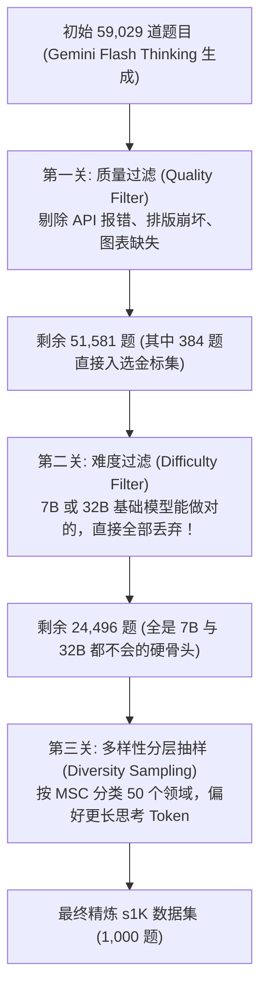
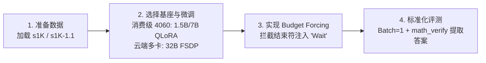

# s1: Simple Test-Time Scaling 原理精讲与复现指南

> **论文题目**：s1: Simple test-time scaling  
> **论文链接**：[arXiv:2501.19393](https://arxiv.org/abs/2501.19393)  
> **作者阵容**：Niklas Muennighoff, Zitong Yang, Weijia Shi, Xiang Lisa Li, Li Fei-Fei, Hannaneh Hajishirzi, Luke Zettlemoyer, Percy Liang, Emmanuel Candès, Tatsunori Hashimoto（来自斯坦福大学、华盛顿大学等）  
> **官方开源仓库**：[simplescaling/s1 (GitHub)](https://github.com/simplescaling/s1)  
> **模型与数据**：[simplescaling/s1-32B (HuggingFace)](https://huggingface.co/simplescaling/s1-32B) | [simplescaling/s1K](https://huggingface.co/datasets/simplescaling/s1K)

---

## 目录
1. [摘要速览与核心立意（Abstract）](#1-摘要速览与核心立意abstract)
2. [引言与时代背景（Section 1: Introduction）](#2-引言与时代背景section-1-introduction)
3. [数据工程精炼之道：s1K 数据集（Section 2: Reasoning data curation to create s1K）](#3-数据工程精炼之道s1k-数据集section-2-reasoning-data-curation-to-create-s1k)
4. [测试时算力扩展机制（Section 3: Test-time scaling）](#4-测试时算力扩展机制section-3-test-time-scaling)
5. [实验战果剖析（Section 4: Results）](#5-实验战果剖析section-4-results)
6. [深度消融实验：打破玄学（Section 5: Ablations）](#6-深度消融实验打破玄学section-5-ablations)
7. [讨论与边界思考（Section 6: Discussion and related work）](#7-讨论与边界思考section-6-discussion-and-related-work)
8. [附录核心精髓：s1.1 与工程暗坑（Appendices）](#8-附录核心精髓s11-与工程暗坑appendices)
9. [实战复现路线图（Reproduction Pipeline）](#9-实战复现路线图reproduction-pipeline)

---

## 1. 摘要速览与核心立意（Abstract）

### 用人话翻译
在 OpenAI 推出 o1、DeepSeek 推出 R1 之后，整个 AI 界意识到了一件事：**让大模型在做题前“多想一会儿”（Test-Time Scaling / 推理期计算扩展），能显著提升回答难题的正确率。**

然而，外界要复现这个能力却异常困难：
- OpenAI 的 o1 闭源且不公开细节。
- 很多复现团队尝试了昂贵的 MCTS（蒙特卡洛树搜索）、复杂的强化学习（RL）流水线，或者蒸馏几十万、上百万条数据，耗资巨大且难以驾驭。

斯坦福和华盛顿大学的这帮作者问了一个极度返璞归真的问题：
> **“要让模型学会‘思考更久做对难题’，最少需要多少数据？最简单的做法究竟是什么？”**

他们给出的答案震撼了开源界：
1. **数据只要 1,000 条（s1K）**：精心挑选 1,000 道涵盖高难度、多样性与优质排版的数学与科学竞赛题，配上长思维链（CoT）。
2. **训练只需普通 SFT**：无需复杂的强化学习框架，只用经典的“下一个 Token 预测”（Next-Token Prediction）。在 16 张 NVIDIA H100 上仅需训练 **26 分钟**（折合 7 个 GPU 时，成本不到 50 美元）。
3. **推理时用一招“强制预算”（Budget Forcing）**：
   - 如果想让模型短想，强行截断思考并逼出答案；
   - 如果想让模型长想，在模型刚想交卷时强行补上一个词——`"Wait"`（等等），逼它复查，模型就会像学生回过神来一样重新验算，并奇迹般地把做错的步骤改对！
4. **最终成果**：基于开源的 `Qwen2.5-32B-Instruct` 训练出的 `s1-32B`，在全美数学邀请赛（AIME24）和 MATH500 上大幅超越 o1-preview，并在追加思考后将 AIME24 准确率从 50% 进一步推升至 57%。

---

## 2. 引言与时代背景（Section 1: Introduction）

过去几年，LLM 性能的提升主要依赖预训练阶段的计算缩放（Chinchilla / Kaplan Scaling Law），即把模型做大、喂更多 Token。当预训练算力遇到边际效应和高质量语料瓶颈时，研究焦点转向了**推理期扩展（Test-Time Compute Scaling）**。

### 业界当时在做什么？
为了复现 OpenAI o1，社区兵分几路：
- **树搜索派**：基于 MCTS / 束搜索（Beam Search）展开多种分支推演，结合过程奖励模型（PRM）打分。缺点是推理速度极慢、显存开销巨大、工程复杂。
- **多智能体派**：让多个 Agent 互相辩驳、投票（Multi-Agent Debate），Token 消耗呈指数膨胀。
- **大规模强化学习派**：如 DeepSeek-R1，通过冷启动数据 + 大规模强化学习探索长思维链，动辄需要数十万甚至数百万样本及庞大集群。

### s1 的立论核心
作者发现：**此前的所有开源尝试，没有任何一个能够透明、稳定地画出一条“算力投入越多、单题表现越好”的清晰测试期扩展曲线。**

s1 的核心贡献是：
1. **提出 s1K 数据筛选哲学**：证明高质量的长思维链对齐不需要百万级别，只要千条级极其精炼的样本即可激活基础模型的 System 2 慢思考能力。
2. **提出 Budget Forcing（预算强迫机制）**：一种完全无需额外模型介入、无需修改模型架构的零成本解码端控制手段。
3. **彻底全开源**：开源权重、1K 训练数据、数据清洗过滤脚本、训练与评测代码，为学术界提供了最清晰透明的基线。

---

## 3. 数据工程精炼之道：s1K 数据集（Section 2: Reasoning data curation to create s1K）

这是本篇论文最具技术价值和启发性的部分。很多团队以为“数据越多越好”，但作者用严谨的过滤实验证明：**胡乱喂 59,000 条数据，还不如精选出的 1,000 条效果好。**

### 3.1 初始 59K 题库与两套独创新数据集
作者从 16 个来源搜集了 59,029 道题目：
- **开源数学与竞赛主力**：NuminaMATH（30,660 题）、历年 AIME 真题（1983-2021）、OmniMath（4,238 道奥赛高难题）。
- **跨学科综合**：OlympicArena（涵盖天文、生物、化学、地理、物理等 4,250 题）、AGIEval（高考、SAT、LSAT 逻辑法学等 2,385 题）。
- **两个全新自研的高纯度子集**：
  1. `s1-prob`（182 题）：来自**斯坦福大学统计系博士资格考试（PhD Qualifying Exams）**的概率论试题，附带高水平手写推导与严谨证明。
  2. `s1-teasers`（23 题）：精选自顶尖量化对冲基金（Quant Trading）面试的高难度脑筋急转弯与逻辑谜题（来自 PuzzledQuant 的 Hard 级别）。

随后，作者调用 **Google Gemini 2.0 Flash Thinking Experimental API**，针对这 59K 道题目生成长思维链推导过程（Reasoning Trace）与最终解答，形成 `(问题, 思考过程, 最终解答)` 三元组。

最后，使用 **8-gram 重叠检测**对所有测试基准（MATH500、GPQA Diamond、AIME24）进行极其严苛的去污染（Decontamination），确保没有一道训练题发生泄露。

### 3.2 降维到 1K 的三大黄金法则（Quality, Difficulty, Diversity）

从 59K 过滤到 1K，作者并不是随机抽样，而是设计了环环相扣的三道过滤器：



#### ① 第一关：质量（Quality）
- 过滤掉任何 API 报错或超时的样本（降到 54,116 条）。
- 过滤排版缺陷：例如包含 ASCII 字符拼图（大模型画不准）、文本中引用了“如下图所示”但实际没有图像的题目、题号混乱不规范的题目（降到 51,581 条）。
- 在这之中，作者提前锁定了 384 道格式极其完美的高质量样本作为金标基础。

#### ② 第二关：难度（Difficulty）
**这是最精妙的一笔：拒绝让模型做简单题！**
- 作者找来未微调的 `Qwen2.5-7B-Instruct` 和 `Qwen2.5-32B-Instruct`，让两个模型把题目都做一遍，并使用 `Claude 3.5 Sonnet` 对照标准答案判卷。
- **筛选规则**：**只要 7B 或 32B 模型中有任何一个能把这道题做对，这道题立刻被淘汰！**
- 理由非常明确：基础模型本来就会做的题，喂给它只会学废话；留在池子里的必须是 7B 和 32B 靠常态直觉“做不对、答不出”的真正难题。数据池瞬间缩减至 24,496 条。
- 此外，统计思维链长度，越难的题目思考长度通常越长。

#### ③ 第三关：多样性（Diversity）
- 如果只挑最难的，题库容易被某些特定几何或微积分难题霸占。
- 作者调用 `Claude 3.5 Sonnet`，依照美国数学会（AMS）制定的 **MSC（Mathematics Subject Classification）** 标准分类体系，将题目打上领域标签（包括代数几何、组合数学、力学、统计、数论等 50 个子领域）。
- **采样算法**：每次在 50 个领域中等概率随机抽取一个领域，在该领域内部，按照“思考 Token 长度”的加权分布抽取 1 道题目。重复这个过程，直到抽满 1,000 道题。

### 3.3 令人深思的核心认知反转：思维链不完美也没关系！
在评测筛选出的 s1K 时，作者发现了一个反常识的事实：
- 经判卷模型核实，Gemini 在这 1,000 道高难题目的思维链最终答案中，**只有 53.6% 是正确的**（后来的 s1.1 提升到 63.0%）。
- 居然有将近一半的答案是错的！那为什么训练出来的模型反而奇强？
- **作者指出的关键机制**：
  在慢思考 SFT 中，模型学习的最重要特征**不是那个最后的固定数字，而是“如何推导、如何分解复杂问题、遇到矛盾如何掉头、如何自我审视”的思考范式与行为习惯**。只要长思维链里展现了充分的探索与演算逻辑，基础模型强大的预训练基底就能在测试时借由这套推理范式把题做对。

---

## 4. 测试时算力扩展机制（Section 3: Test-time scaling）

测试时扩展（Test-time Scaling）的核心目标是：**在推理阶段多花一点算力（生成更多 Token），换取更高准确率。**

### 4.1 串行扩展 (Sequential) vs 并行扩展 (Parallel)
- **并行扩展（Parallel）**：如 Majority Voting（采样 64 次取投票众数）或 Best-of-N。每次生成彼此独立，后生成的回答无法吸取前一个回答的教训，本质是依靠多次采样的概率覆盖，计算效率低。
- **串行扩展（Sequential）**：在单个上下文中持续推理，后面的步骤依赖前面的推导，能够做深度假设检验、回溯修正。s1 聚焦于串行扩展。

### 4.2 核心武器：Budget Forcing（预算强迫机制）
既然希望控制模型的思考时间，最直接的办法就是在解码阶段干预。作者提出了非常简洁的 **Budget Forcing**：

```
[模型接收 Prompt] 
       │
       ▼
[开始思考...] ─── (逐步吐出 <|im_start|>think 的 Token)
       │
       ├─► 情况 A: 想要限制思考算力 (早期刹车)
       │         当思考 Token 数达到上限（如 1024 Token）时：
       │         强行截断，直接追加 `<|im_start|>answer\n` 甚至 `Final Answer:`
       │         ──► 模型立刻中断草稿，被迫基于当前已知信息总结出最终答案。
       │
       └─► 情况 B: 想要提升答题质量 (强行续命/深度反思)
                 当模型思考完毕，准备吐出 `<|im_start|>answer` 标志收工时：
                 解码器强行拦截并屏蔽该结束符！
                 取而代之，直接在末尾拼上一句：
                 "Wait, let me double check..." 或单字 "Wait"
                 ──► 模型被这句突如其来的 "Wait" 瞬间点醒，开始自我纠错！
```

在这个机制下，模型不会盲目复读，而是会重新审视刚才的关键步骤，反复推敲有没有漏掉边界条件或算错乘法。

### 4.3 与常见基线的对比与反常识坑点
作者对比了其他看似更高级的长度控制方法，发现了许多极具启发性的大模型弱点：

1. **Token 级控制（Prompt 里要求：请在 2048 个 Token 内完成思考）**：
   - **完全失败**。现有大模型根本不具备实时的 Token 计数能力，无论怎么 Prompt，模型依然会严重超标或乱答。
2. **步骤级控制（Prompt 里要求：请用 16 个步骤思考，每步倒计时）**：
   - **模型会偷奸耍滑**。如果限制它只能走很少的步骤，它就会把每一句话写得无比冗长；如果给它很多步骤，它每一步就只写两三个词，甚至倒数到负数步骤（`-1 steps left...`），控制极其不稳定。
3. **拒绝采样（Rejection Sampling：只要生成长度不足 8000 Token 就重抽）**：
   - **惊天反常识：思考越长，反而越容易做错（Inverse Scaling）！**
   - 作者经过案例分析发现：模型如果真的懂这道题，通常在较短的链条内就能直奔正确思路；而那些自发写到 8000 Token 以上的样本，往往是因为模型一开始就走进了死胡同，在里面晕头转向、反复碰壁。因此强行挑选超长采样的样本，反而选出了一堆逻辑混乱的废稿。
   - **Budget Forcing 为什么没有这个毛病？** 因为它是当模型即将给出答案的那个瞬间从外部施加冲击，引导它带着明确的上下文做一次局部回溯，而不是无头苍蝇式地从头重新纠缠。

### 4.4 衡量测试期扩展的三大指标
作者提出了评估测试期扩展方法优劣的标准体系：
- **Control（可控性）**：方法能否精确将算力约束在指定预算内？（Budget Forcing 达到 100% 可控）。
- **Scaling（扩展斜率）**：增加 Token 预算时，性能曲线的斜率是否为正？斜率越大越好。
- **Performance（性能极限）**：该方法最终能冲到的最高准确率是多少？

---

## 5. 实验战果剖析（Section 4: Results）

### 5.1 实验配置
- **基座模型**：`Qwen2.5-32B-Instruct`
- **训练资源**：16 张 NVIDIA H100，PyTorch FSDP，训练 5 个 Epoch（仅 315 个梯度更新步），耗时 **26 分钟**
- **评测数据集**：
  - **AIME 2024**：30 道全美高中数学邀请赛高难题，答案为 000-999 的整数。
  - **MATH500**：OpenAI 筛选的 500 道涵盖各层级的竞赛数学题。
  - **GPQA Diamond**：198 道博士级物理、化学、生物高难单选题（人类博士仅能拿到约 69.7%）。

### 5.2 核心战报数据对比

| 模型类别 | 模型名称 | 训练数据量 | AIME24 (Pass@1) | MATH500 (Pass@1) | GPQA Diamond |
| :--- | :--- | :--- | :--- | :--- | :--- |
| **基座模型** | Qwen2.5-32B-Instruct | 原始基座 | 16.7% | 79.8% | 49.0% |
| **闭源顶尖** | OpenAI o1-preview | 未公开 (海量 RL) | 40.0% | 85.5% | 73.3% |
| **同门竞技** | QwQ-32B-preview | 未公开 | 50.0% | 90.6% | 65.2% |
| **同类蒸馏** | Sky-T1-32B-Preview | 17,000 题 | 43.3% | 86.8% | 61.1% |
| **同类蒸馏** | Bespoke-Stratos-32B | 17,000 题 | 50.0% | 87.4% | 65.2% |
| **本项目** | **s1-32B (无干预)** | **仅 1,000 题 (s1K)** | **50.0%** | **90.0%** | **61.1%** |
| **本项目** | **s1-32B + Budget Forcing (Wait)** | **仅 1,000 题 (s1K)** | **57.0%** | **93.0%** | **65.2%** |
| **后续升级** | **s1.1-32B + Budget Forcing** | **仅 1,000 题 (s1K-1.1)** | **70.0%** | **95.2%** | **68.2%** |

### 5.3 核心发现
1. **碾压 o1-preview**：仅用 1000 条公开蒸馏数据微调后的 32B 模型，在 AIME24 上达到 57%，大幅超越了当年轰动全球的 o1-preview（40%）。
2. **极高的样本效率**：对比 DeepSeek-R1-Distill-Qwen-32B，虽然 R1 蒸馏版更强，但 R1 使用了 800,000 条长思维链样本，而 s1 仅用了其 **八百分之一** 的数据量就达到了极具竞争力的水平。
3. **串行 Scaling 完胜投票**：在相同的 Token 消耗下，给 s1 喂 "Wait" 进行串行思考扩展，准确率提升速度明显快于给 Base 模型搞 64 路多数投票。

---

## 6. 深度消融实验：打破玄学（Section 5: Ablations）

### 6.1 数据筛选消融（为什么三条法则缺一不可？）
作者对比了不同的 1K 数据子集训练效果：
- **只讲质量（1K-random）**：从洗好的 5 万题里随机抓 1000 题。结果 AIME24 暴跌至 26.7%（相当于腰斩）。证明简单题充数会极大损害推理能力。
- **只讲多样性（1K-diverse）**：每个领域均匀抓题，不管难度。AIME24 仅 23.3%，同样极差。
- **只讲难度（1K-longest）**：只挑思维链 Token 最长的 1000 题。GPQA 表现不错，但数学竞赛严重偏科，容易学到死板的长句式。
- **大力出奇迹（59K 全量训练）**：把 5.9 万条全部拿来练，消耗了 **394 个 H100 卡时**（是 s1K 的 56 倍），然而在 AIME24 上的表现与 1K 相比几乎没有统计学上的显著优势！
- **结论**：**“难而精”的数据组合（排除基础模型已知题 + 领域均衡 + 加权长思考）是小数据激发出大智慧的唯一法门。**

### 6.2 测试期干预消融
- **追加提示词的测试**：作者对比了在拦截思考结束符后追加的字符串：
  - 单字 `"Wait"` 的表现最为稳健，模型能自然顺着语境展开下一轮逻辑排查。
  - 过于冗长的提示词（如 `"Wait, think carefully again..."`）反而容易引起模型困惑或过拟合。
- **追加次数的边际递减**：
  - 追加 1 到 4 次 "Wait"，性能稳步攀升。
  - 在追加到第 6 次（约 7000+ Token）时，AIME24 达到峰值 57%。
  - 如果强行按住不让停超过 8 次以上，模型由于无法走出困境，会退化为车轱辘话死循环（Repetitive Loops），性能开始掉头向下。

---

## 7. 讨论与边界思考（Section 6: Discussion and related work）

### 7.1 为什么区区 1,000 条样本就能让模型脱胎换骨？
作者引用了著名论文 LIMA 中的**“表层对齐假说”（Superficial Alignment Hypothesis）**：
- 现代基座大模型（如 Qwen2.5-32B）在万亿级预训练 Token 中，早已经见过海量的数学推导、科学文献和代码，它的大脑里已经沉淀了深厚的推理能力。
- 基础的 Instruct 模型之所以不会深思熟虑，是因为常规对话微调教会它“直奔答案”，把它塑造成了一个急于交卷的学生。
- 这 1,000 条极端优质的长思维链，**不是在教模型新的数理知识，而是在对齐模型的输出格式与心智模式**：教会它使用草稿纸，教会它慢下来反复自查。

### 7.2 串行测试期扩展的物理天花板
1. **上下文窗口（Context Window）限制**：持续追加 "Wait" 会消耗宝贵的上下文空间。一旦超出模型的有效注意力窗口，模型不仅不会变聪明，反而会发生灾难性遗忘。
2. **混合求解才是未来**：为了突破单条思维链的上限，作者提出将 Budget Forcing 与过程奖励模型（如 REBASE PRM 树搜索）或多路并行投票结合，兼顾深思与多视角广度。

---

## 8. 附录核心精髓：s1.1 与工程暗坑（Appendices）

### 8.1 Appendix A: s1.1 极速迭代
在原论文发布仅 7 天后，DeepSeek-R1 震撼发布。作者立刻展开了 s1.1 实验：
- 题库完全不变（依然是那 1,000 道题）。
- 用 **DeepSeek-R1** 重新生成这 1,000 道题的思维链，制成 `s1K-1.1`。
- 相同超参数微调后，`s1.1-32B` 的 AIME24 成绩直接跃升至 **70.0%**，MATH500 达到 **95.2%**，逼近 OpenAI o3-mini 的恐怖水准！

### 8.2 Appendix B: 评测确定性大坑（Evaluation Determinism）
这是所有打算复现长思维链评测的开发者**必须铭记的工程大坑**：
- 作者在使用业界通用的 `vLLM` 引擎进行贪婪解码（Greedy, Temp=0）时发现：**即使随机种子完全固定，两次评测的得分依然可能天差地别！**
- **元凶分析**：
  1. **Batch Size 变化**：不同批次大小下，底层 CUDA 核心的浮点数累加顺序存在极其细微的舍入误差。
  2. **张量并行（Tensor Parallelism）**：多卡间 AllReduce 的浮点累加不可避免有浮点抖动。
  3. **长链蝴蝶效应**：对于普通问答，最后一位小数的误差毫无影响；但对于 8,000 Token 的长思维链，在第 1,200 个 Token 处仅仅一个词的微小概率反转，就会导致后面的推导方向彻底分道扬镳，最后得出一个完全不同的解！
- **作者的防坑军规**：
  - 终极评测尽量使用 **全精度（FP32/BF16 原生避免过度截断）**。
  - 严格保持 **Batch Size = 1**。
  - 在统一硬件和统一框架环境下比对结果。

### 8.3 Appendix D: 训练关键超参数
- **格式规范（ChatML 风格分隔符）**：
  ```text
  <|im_start|>system
  You are a helpful assistant.<|im_end|>
  <|im_start|>user
  [题目内容]<|im_end|>
  <|im_start|>think
  [详细推导思考过程]
  <|im_start|>answer
  [最终回答内容]<|im_end|>
  ```
- **Loss Masking**：**只对 think 和 answer 部分计算交叉熵 Loss**，对 System 和 User 题目 Prompt 完全屏蔽（Loss Mask = 0）。
- **训练参数**：
  - 学习率：`1e-5`，带 5% 线性预热（Warmup），随后余弦退火（Cosine Decay）至 0。
  - Batch Size：16。
  - Epoch：5 次（总共仅 315 步）。
  - 优化器：AdamW（$\beta_1=0.9, \beta_2=0.95$, Weight Decay = `1e-4`）。

---

## 9. 实战复现路线图（Reproduction Pipeline）

结合当前项目环境与硬件条件，以下是落地的具体复现步骤：



### 第一阶段：环境与数据准备
1. **安装依赖**：
   本仓库已在 [requirements.txt](file:///D:/myproject/llm-journey/s1-reproduce/requirements.txt) 中配置好了针对 Windows 及单卡环境的依赖。
   ```bash
   pip install -r requirements.txt
   ```
2. **下载数据集**：
   直接从 HuggingFace 载入官方精选的 1K 数据：
   ```python
   from datasets import load_dataset
   # 加载原版或 1.1 版数据
   dataset = load_dataset("simplescaling/s1K-1.1")
   print(f"数据条数: {len(dataset['train'])}")
   ```

### 第二阶段：模型微调（因地制宜）

#### 方案 A：本地开发与概念验证（如单张 RTX 4060 8GB / 单消费卡）
受限于 8GB 显存，无法直接跑 32B 全量微调。可采用极简验证法：
- **基座选择**：`Qwen/Qwen2.5-1.5B-Instruct` 或 `Qwen/Qwen2.5-7B-Instruct`。
- **微调技术**：`bitsandbytes` 4-bit 量化 + `PEFT` LoRA（QLoRA）。
- **关键脚本结构**：使用 `trl.SFTTrainer`，配置 `DataCollatorForCompletionOnlyLM` 确保只对 `<|im_start|>think` 后的内容计算损失。

#### 方案 B：完整高保真复现（多卡 Linux 集群 / 租用算力）
- **基座选择**：`Qwen/Qwen2.5-32B-Instruct`。
- **训练方案**：
  - 官方采用 16 卡 H100 + PyTorch FSDP，耗时 26 分钟。
  - 在 8 卡 A100 (80GB) 或 4 卡 H100 上，使用 DeepSpeed ZeRO-3 配合 CPU Offload 亦可完整跑通（耗时约 1~2 小时）。

### 第三阶段：推理端 Budget Forcing 实现

Budget Forcing 的本质是解码循环中的 Token 拦截。在原生 Hugging Face `transformers` 下，可以通过编写一个轻量的分段生成逻辑或自定义 StoppingCriteria 实现：

```python
import torch
from transformers import AutoModelForCausalLM, AutoTokenizer

def generate_with_budget_forcing(
    model, 
    tokenizer, 
    prompt_text, 
    max_wait_count=4, 
    max_new_tokens=8192
):
    """
    通过分段拦截实现 Budget Forcing 的极简示范
    """
    # 构造输入
    input_ids = tokenizer.encode(prompt_text, return_tensors="pt").to(model.device)
    
    # 记录当前已触发 Wait 的次数
    wait_counts = 0
    answer_token = "<|im_start|>answer"
    
    current_ids = input_ids
    while wait_counts < max_wait_count:
        # 生成直到遇见思考结束符或最大长度
        outputs = model.generate(
            current_ids,
            max_new_tokens=2048,
            temperature=0.0, # 贪婪解码保持稳定
            eos_token_id=tokenizer.encode(answer_token)[0], # 遇 answer 停下
            do_sample=False
        )
        
        # 检查是否准备转入 answer 阶段
        generated_text = tokenizer.decode(outputs[0][current_ids.shape[-1]:])
        
        if answer_token in generated_text or outputs[0][-1] == tokenizer.eos_token_id:
            # 强行剥离结束符，注入 Wait 并逼迫重思考
            wait_text = "\nWait, let me rethink and verify this step carefully.\n"
            wait_ids = tokenizer.encode(wait_text, return_tensors="pt").to(model.device)
            current_ids = torch.cat([outputs, wait_ids], dim=-1)
            wait_counts += 1
        else:
            current_ids = outputs
            break

    # 思考预算耗尽，注入强制转折词，直接输出最终答案
    finalize_text = "\n<|im_start|>answer\nFinal Answer: "
    finalize_ids = tokenizer.encode(finalize_text, return_tensors="pt").to(model.device)
    final_input = torch.cat([current_ids, finalize_ids], dim=-1)
    
    final_outputs = model.generate(
        final_input,
        max_new_tokens=1024,
        temperature=0.0,
        do_sample=False
    )
    return tokenizer.decode(final_outputs[0])
```

### 第四阶段：标准化评测与避坑要点
1. **评测基准选用**：
   - 入门推荐：`MATH500`（题量适中，题型全面）。
   - 进阶检验：`AIME 2024`（30 题，纯整数答案，对比指标最灵敏）。
2. **提取器选用**：
   - 使用官方推荐的 `math_verify` 库或 SymPy 进行符号等价性验证，避免因模型输出 LaTeX 格式略有差异而误判。
3. **单卡 Batch Size = 1**：
   - 彻底杜绝批处理与并行计算中的浮点累加抖动，确保评测曲线具备 100% 可重复性。

---

## 10. 总结与启发

s1 论文最大的意义，在于用近乎极简主义的优雅，击碎了大模型慢思考领域的高墙：
- **它告诉我们**：不要盲目崇拜庞大数据集。1,000 条找准痛点、剪裁得当的钻石级题目，胜过 10 万条平庸对话。
- **它启发我们**：大模型不需要改动复杂底层结构，仅仅靠解码阶段一个小小的“等等（Wait）”，就能释放出令人惊叹的自省与纠错潜能。
